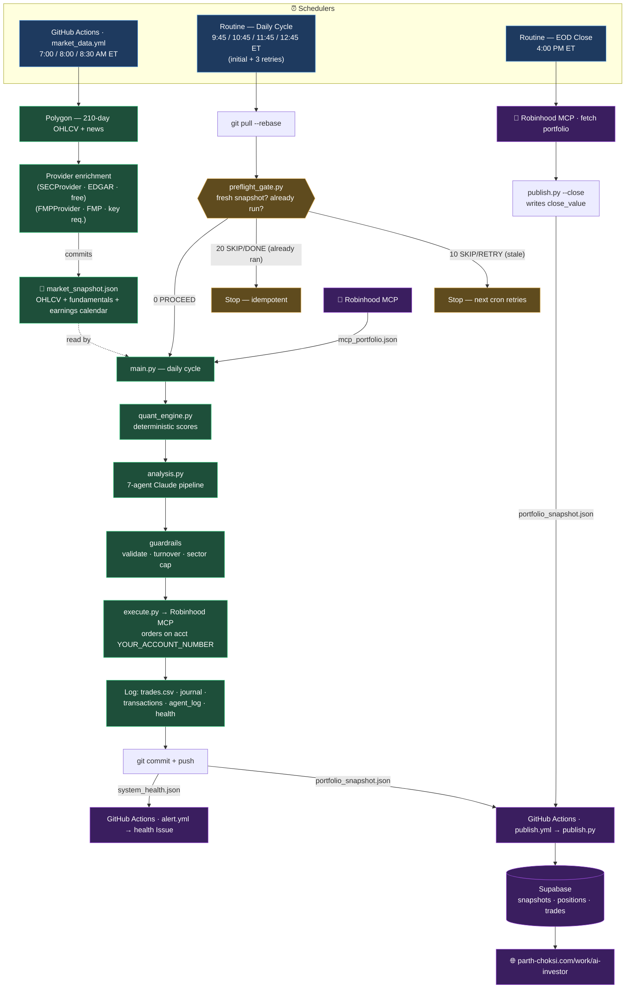

# AI Investor — Flow Diagrams

> **⚠ ARCHIVED (2026-07-05) — DIAGRAMS ARE FACTUALLY OUT OF DATE, not just old.**
> Drawn 2026-06-14, before Phase 4/5 shipped. The gate diagram below shows only 3
> exit codes (0/10/20) — the live gate has a 4th (**30 PROCEED/RISK-WATCH**) and
> branches to `risk_watch.py` on non-rebalance days, which isn't shown at all; there
> is no dossier, no Stage A–D. Do not use this to understand current system
> behavior. No replacement diagram exists yet — treat this as a starting reference
> for what the OLD daily-only pipeline looked like, not the current one.

Two views of the same system: a **high-level** map of the daily lifecycle, and a
**detailed** end-to-end diagram of the pipeline, the 7-agent stack, guardrails,
idempotency, and health/alerting. Both are rendered from the actual orchestration
in [../main.py](../main.py) and [../analysis.py](../analysis.py).

---

## 1. High-Level Flow

---

## 2. Detailed End-to-End Flow

```mermaid
flowchart TB
    START(["Routine fires (every attempt)"]) --> P0

    subgraph PRE["STEP 0 — Pre-flight Gate (preflight_gate.py)"]
        P0["git pull --rebase"] --> PG{{"Gate decision"}}
        PG -->|"exit 10 · snapshot missing / not today"| EX10["SKIP/RETRY"]
        PG -->|"exit 20 · executed today or stale claim"| EX20["SKIP/DONE<br/>recover via Scenario B"]
        PG -->|"exit 0 · fresh 22+ bars AND not run"| RUN["Run main.py (DRY_RUN=false)"]
    end

    RUN --> S1
    subgraph PIPE["main.py — run_daily_cycle()"]
        S1["Step 1 · Portfolio<br/>get_portfolio_summary from mcp_portfolio.json"] -->|"StalePortfolioError (as_of not today)"| ABORTP["ABORT → health + alert"]
        S1 --> S2["Step 2 · Kill switches<br/>drawdown over 20% from peak"]
        S2 --> S3["Step 3 · Market data<br/>get_market_snapshot()<br/>reads committed snapshot (OHLCV +<br/>EDGAR/FMP enriched fundamentals)"]
        S3 -->|"data_date not today OR depth under 22"| ABORTM["ABORT → health + alert"]
        S3 --> S4["Step 4 · Quant scores<br/>momentum / quality / valuation / risk"]
        S4 -->|"all scores 50"| QFAIL["quant_scores FAILED"]
        S4 --> AGENTS
    end

    subgraph AGENTS["Step 5 — 7-Agent Pipeline (analysis.py)"]
        direction TB
        A1["① Market Regime Strategist · Sonnet<br/>Risk-On / Neutral / Risk-Off"]
        A1 --> CAND["_select_candidates()<br/>holdings + top-quant + news (max 20)"]
        CAND --> PAR23["② Research + ③ Earnings · Haiku (cached)<br/>per-ticker · PARALLEL"]
        PAR23 --> A4["④ Devil's Advocate · Haiku (cached)<br/>per-ticker · parallel · recommend_reject"]
        A4 --> A5["⑤ Position Review · Haiku (cached)<br/>per-holding · HOLD / REDUCE / EXIT"]
        A5 --> A6["⑥ Portfolio Manager · Sonnet<br/>→ target_weight trade list"]
        A6 --> A7{"⑦ Chief Risk Officer · Sonnet<br/>veto · correlation + concentration"}
        A7 -->|"approved false"| VETO["All trades dropped"]
        A7 -->|"rejected_tickers"| FILT["Drop vetoed tickers"]
        A7 -->|"approved"| OUT["decisions[]"]
        FILT --> OUT
    end

    MEM[("Memory feedback (journal)<br/>ticker_history + recently_exited")] -.->|"into Research + PM"| AGENTS

    OUT --> QTY["Pre-compute fractional qty<br/>_compute_qty(target_weight)"]

    subgraph GUARD["Guardrails — deterministic, AFTER LLM"]
        direction TB
        G1["validate_decisions()<br/>whitelist · BLOCKED (TSLA) · clamp 0-10%<br/>notional cap 12% · 5 USD min · GFV"]
        G1 --> G2["enforce_min_holding_period()<br/>block SELL bought under 5 trading days"]
        G2 --> G3["enforce_wash_sale_reentry()<br/>block BUY sold under 30 cal. days"]
        G3 --> G4["enforce_sector_limits()<br/>25% sector cap (SELLs free budget)"]
    end

    QTY --> GUARD
    GUARD --> ENV["Write pending_decisions.json<br/>run_id · date · execution_started_at · executed_at"]
    ENV --> AGENTLOG["record_run() → agent_log.json"]

    AGENTLOG --> EMPTY{"decisions empty?"}
    EMPTY -->|"yes"| PUBONLY["Publish only → done (no trades)"]
    EMPTY -->|"no"| CB{"Circuit breaker<br/>SELL notional over 50%?"}
    CB -->|"yes"| HALT["HALT → health FAILED"]
    CB -->|"no"| KILL{"Kill switch active?"}
    KILL -->|"yes"| SELLONLY["Block BUYs · SELLs only"]
    KILL -->|"no"| ALLORD["All orders"]
    SELLONLY --> CLAIM
    ALLORD --> CLAIM

    subgraph EXECUTE["Step 6 — Execution (idempotency-protected)"]
        direction TB
        CLAIM["mark_execution_started(run_id)<br/>stamp + push BEFORE first order"]
        CLAIM --> ORD["execute_trades() → Robinhood MCP<br/>SELL-before-BUY · per-order try/except"]
        ORD --> VERIFY{"order_executed()?<br/>broker returned id?"}
        VERIFY -->|"no id → rejected"| FAILORD["failed_orders<br/>health DEGRADED/FAILED"]
        VERIFY -->|"id present"| FILLED["executed_decisions"]
        FILLED --> STAMP["mark_pending_executed(run_id)<br/>(only if something placed)"]
    end

    STAMP --> S7
    subgraph LOGGING["Step 7 — Logging + Feedback Loop"]
        direction TB
        S7["log_trades() → trades.csv<br/>(+ 100x paper-shadow cols)"]
        S7 --> TX["record_transaction() → transactions.json"]
        TX --> JRN["record_trade() → decision_journal.json<br/>thesis · anti-thesis · invalidates_if"]
        JRN --> CLOSEP["close_position() on SELL<br/>realized return · thesis_correct"]
    end

    CLOSEP --> S8["Step 8 · publish_to_supabase()<br/>(403 in cloud — writes file only)"]
    S8 --> S9["Step 9 · system_health.json<br/>OK / DEGRADED / FAILED / ABORTED"]
    S9 --> COMMIT["git commit + push (full artifact set)"]
    ABORTP --> COMMIT
    ABORTM --> COMMIT
    HALT --> COMMIT
    PUBONLY --> COMMIT

    COMMIT -->|"portfolio_snapshot.json"| PUBYML["publish.yml → publish.py<br/>(Supabase reachable in GH Actions)"]
    COMMIT -->|"system_health.json"| ALERTYML["alert.yml → health-alert Issue"]
    PUBYML --> SUPA[("Supabase")]
    SUPA --> WEB["🌐 Website dashboard"]

    RECON["mark_transactions_live(fills)<br/>reconcile vs broker fills"] -.->|"authoritative for 3 logs"| LOGGING

    classDef gate fill:#5f4b1e,stroke:#d9a94a,color:#fff
    classDef abort fill:#5f1e1e,stroke:#d94a4a,color:#fff
    classDef agent fill:#1e3a5f,stroke:#4a90d9,color:#fff
    classDef guard fill:#1e4f3a,stroke:#4ad98f,color:#fff
    classDef ext fill:#3a1e5f,stroke:#9a4ad9,color:#fff
    class PG,EX10,EX20 gate
    class ABORTP,ABORTM,HALT,QFAIL,VETO,FAILORD abort
    class A1,A4,A5,A6,A7,PAR23 agent
    class G1,G2,G3,G4 guard
    class PUBYML,ALERTYML,SUPA,WEB ext
```

---

### Agent reference

| # | Agent | Model | Scope | Output |
|---|-------|-------|-------|--------|
| 1 | Market Regime Strategist | Sonnet | Portfolio | Risk-On / Neutral / Risk-Off + factors |
| 2 | Research Analyst | Haiku (cached) | Per-ticker | Thesis, variant view, catalysts, `invalidates_if` |
| 3 | Earnings & Catalyst Analyst | Haiku (cached) | Per-ticker | 90-day events, `earnings_alpha_score` |
| 4 | Devil's Advocate | Haiku (cached) | Per-ticker | Bear case, `recommend_reject` |
| 5 | Position Review Analyst | Haiku (cached) | Per-holding | Hold score, HOLD / REDUCE / EXIT |
| 6 | Portfolio Manager | Sonnet | Portfolio | `target_weight` trade list |
| 7 | Chief Risk Officer | Sonnet | Portfolio | Veto power, `rejected_tickers` |

Haiku agents (2–5) run **in parallel** across up to 20 candidates with prompt
caching; Sonnet agents (1, 6, 7) run once each. Three independent abort gates
(stale portfolio, stale/shallow market data, preflight) fire before any agent
runs, and **stamp-first idempotency** biases every failure toward missed trades,
never duplicate trades.
